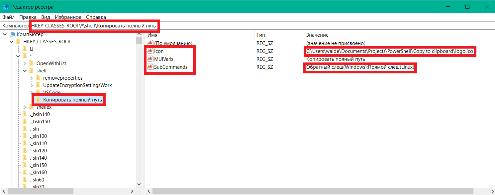
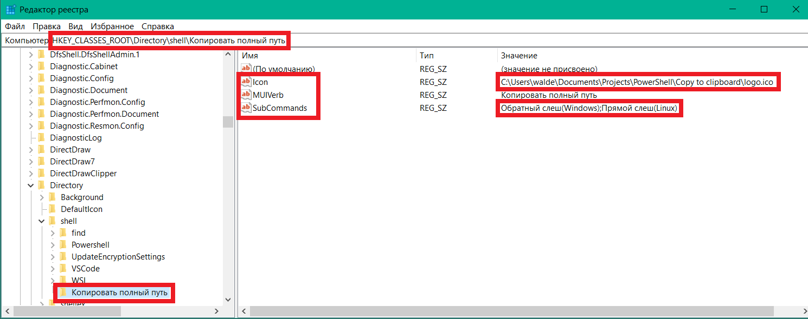
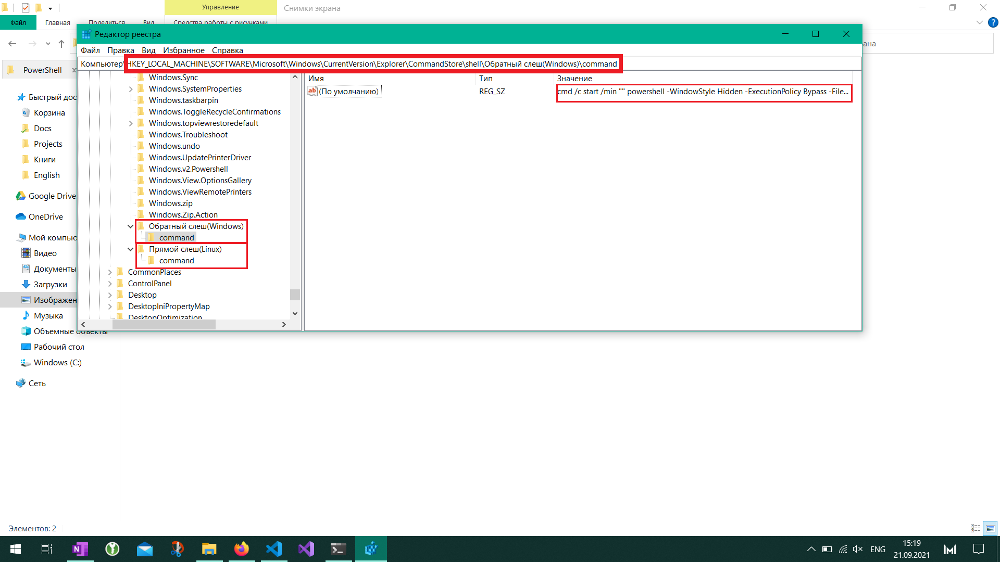
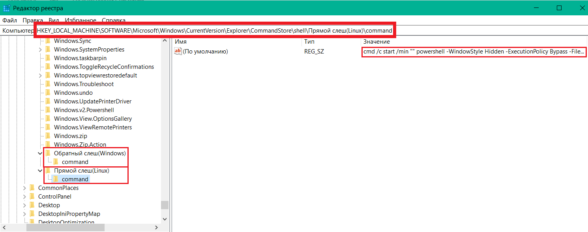

# Copy-the-full-path

<div>
<p align="center">
    
</p>
<h3  align="center">Copy the full path</h3>
</div>

## Description
It is the simple PowerShell script that can help you to copy full paths files or folders from Windows' explorer context menu.

## How it work?
You have a file or folder and you need to copy full path of it. You just make a right-mouse click, select a needed you type of slash(in windows style or in linux) and use it in your terminal or an another program.

I don't know why Microsoft didn't make this useful function in the Explorer 🤔.

## Gif exaples
### Example of work of my script on video-mkv file


### Example of work of my script on folder 


## Installation
I'm sorry but I don't have time for writing an Installation cmd or ps1 script 😔. Maybe in future I will make it.

But I can describe how to change your registry in Windows to get such result 🥳 😄 😉.

1. Download the repository in some folder. For example in `C:\`
```bash
git clone https://github.com/waldemar13311/Copy-the-full-path.git
```

2. Open `regedit.exe`
3. Create these folders in the regestry and create keys like in screens:
```
HKEY_CLASSES_ROOT\*\shell\Copy the full path
HKEY_CLASSES_ROOT\Directory\shell\Copy the full path

HKEY_LOCAL_MACHINE\SOFTWARE\Microsoft\Windows\CurrentVersion\Explorer\CommandStore\shell\Backslash(Windows-style)
HKEY_LOCAL_MACHINE\SOFTWARE\Microsoft\Windows\CurrentVersion\Explorer\CommandStore\shell\Backslash(Windows-style)\command

HKEY_LOCAL_MACHINE\SOFTWARE\Microsoft\Windows\CurrentVersion\Explorer\CommandStore\shell\Slash(Linux-style)
HKEY_LOCAL_MACHINE\SOFTWARE\Microsoft\Windows\CurrentVersion\Explorer\CommandStore\shell\Slash(Linux-style)\command
```
### Be careful! Use your paths to files!
#### It is creating item for files. 


#### It is creating item for folders. Icon, MUIVerb and SubCommands.


#### Is is creating sub-item for copy in backslash-style. Icon, MUIVerb and SubCommands.



Use Date in (Default) like this:
```ps1
cmd /c start /min "" powershell -WindowStyle Hidden -ExecutionPolicy Bypass -File "C:\Users\walde\Documents\Projects\PowerShell\Copy to clipboard\main.ps1" "%1" "windows"
```

#### Is is creating sub-item for copy in slash-style

And like this:
```ps1
cmd /c start /min "" powershell -WindowStyle Hidden -ExecutionPolicy Bypass -File "C:\Users\walde\Documents\Projects\PowerShell\Copy to clipboard\main.ps1" "%1" "linux"
```

## Thank you for reading and good!