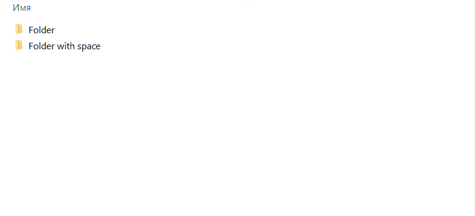

# Copy-the-full-path

<div>
<p align="center">
    
</p>
<h3  align="center">Copy the full path</h3>
</div>

1. [Description](#description)
2. [How it work?](#howitwork)
3. [Gif exaples](#gifexaples)
4. [Installation](#installation)
5. [Uninstallation](#uninstallation)

## Description <a name="description"></a>
It is a simple PowerShell script that can help you copy full paths of files or folders from Windows' explorer context menu.

## How it work? <a name="howitwork"></a>
You have a file or folder and you need to copy the full path of it. You just make a right-mouse click, select the needed type of slash(in Windows style or in Linux style or style for WSL) and use it in your terminal or another program.

I don't know why Microsoft didn't make this useful function in the Explorer 🤔.

## Gif exaples <a name="gifexaples"></a>
### Example of work with a file
#TODO !!! NewGIF


### Example of work with a folder
#TODO !!! NewGIF


## Installation <a name="installation"></a>
For installation, **you need administrative rights** because the installation ps1 script will change your windows registry.

1. As an administrator, run your command line
2. Copy this repository in some folder
```powershell
PS C:\Users\user\Downloads> git clone https://github.com/waldemar13311/Copy-the-full-path.git
```
3. Change a folder to Copy-the-full-path
```powershell
PS C:\Users\user\Downloads> cd .\Copy-the-full-path\
```
4. Run install.ps1
```powershell
PS C:\Users\user\Downloads\Copy-the-full-path> .\install.ps1
```
5. Enter a path where you want to have a Copy-the-full-path. In this case, for example, installation will take place in `C:\Program Files`.

```powershell
PS C:\Users\user\Downloads\Copy-the-full-path> .\install.ps1
Hello!
To the correct installation you need start this script with administrative rights
Enter a path where you want to have a folder with Copy-the-full-path: C:\Program Files

Copy-the-full-path will be install in C:\Program Files

...(some output)
```
6. That's all
   
## Uninstallation <a name="uninstallation"></a>
1. Also, as an administrator, run your command line
2. Run uninstall.ps1 from this repo
3. Enter a path to Copy-the-full-path. In this case, is `C:\Program Files\Copy-the-full-path`
```powershell
PS C:\Users\walde\Downloads\Copy-the-full-path> .\uninstall.ps1
To uninstall Copy-the-full-path enter a directory where it has installed: C:\Program Files\Copy-the-full-path

...(some output)
```
6. That's all

### Thank you for reading and good luck 😘🥳💘!